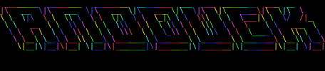

  

## Anoduck: The Anonymous Duck  

*I support freedom of speech, and the free exchange of ideas within the market place of one's mind.*

----------

_This will be a continual work in progress_  

### What I do:  

- Scrapers of all types and varieties  
- OSINT Recon  
- Social Engineering  
- Photo Scraping  
- Org Mode  
- OpenBSD  
- Agricultural Technology  

### Awesome Developers  

Here are some developers who I found to be polite and generous.  

- [leo-arch](https://github.com/leo-arch)  
- [bullshark](https://github.com/bullshark)  
- [kovidgoyal](https://github.com/kovidgoyal)  
- [deepbluev7](https://github.com/deepbluev7)  

### Daily Drivers  

Here are some projects I use in my daily life.  

- Zsh  
- Kitty  
- EMACS  
- Org-Mode  
- Oh-My-Zsh  

### Developmental Principles  

Here are some developmental principles I believe in.  

- Pay for use Api-Keys prevent access to technology and thus technological innovation.  
- Discord is closed source and has a terrible reputation, use element instead.  
- Linux Elitism is in poor taste. UNIX, BSD, and other open source operating systems exist.  
- Avoid "Not my problem" -ism.  
